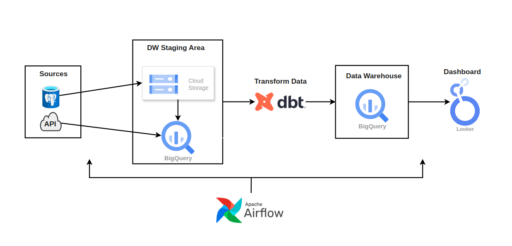

# Olist Data Engineering Project

This repository contains the full documentation, SQL queries, data pipelines, and project files for the Olist data engineering project. The goal of this project is to move raw data from multiple sources to Google BigQuery, transform it into a star schema using dbt, orchestrate the data pipeline using Apache Airflow, and visualize key business insights in a Looker Studio dashboard.

---

## 🔗 **Dashboard Link**
[View the Dashboard](https://lookerstudio.google.com/s/rMX7np_is3o)

---

## 🎯 **Project Overview**
The Olist project is a comprehensive data engineering task that involves:
1. **Data Transfer**: Moving data from a PostgreSQL database and API endpoints to Google BigQuery.
2. **Data Modeling**: Applying transformations to create a star schema using dbt.
3. **Pipeline Orchestration**: Using Apache Airflow to automate data ingestion and transformation.
4. **Data Visualization**: Building an interactive dashboard in Looker Studio to answer key business questions.

---

## 📊 **Insights Covered in the Dashboard**
1. Which customer has the highest lifetime value?
2. What is the total number of orders placed each month (trend over time)?
3. What is the monthly revenue trend for the business?
4. What is the distribution of payment methods used by customers?
5. Who are the top customers by total order value?
6. What are the top-selling products by quantity?

---

## 🖥️ **Project Architecture**
The architecture of the Olist data engineering project is as follows:

1️⃣ **Data Sources**
- PostgreSQL Database
- API Endpoints

2️⃣ **Data Ingestion**
- Data from the PostgreSQL database is ingested into Google Cloud Storage.
- API data is directly loaded into BigQuery.

3️⃣ **Data Transformation**
- dbt is used to create models in BigQuery and apply transformations to organize data into a star schema.

4️⃣ **Pipeline Orchestration**
- Apache Airflow manages the entire data pipeline, scheduling data ingestion, transformations, and updates to the dashboard.

5️⃣ **Visualization**
- Looker Studio connects to BigQuery views to provide interactive dashboards with key business insights.

### 🧩 **Architecture Diagram**

---

## 🔧 **Tools and Technologies Used**
### 1️⃣ **Google BigQuery**
- Used to store, query, and manage the dataset.
- Transformed raw data into meaningful insights using views created by dbt models.
- Documentation: [Google BigQuery Documentation](https://cloud.google.com/bigquery/docs)

### 2️⃣ **Looker Studio**
- Used to build an interactive dashboard to visualize insights.
- Integrated with BigQuery to pull data directly from dbt-generated views.
- Documentation: [Looker Studio Documentation](https://support.google.com/lookerstudio/)

### 3️⃣ **Google Cloud Storage (GCS)**
- Used to store and manage raw data files.
- Connected GCS to BigQuery for data ingestion.
- Documentation: [Google Cloud Storage Documentation](https://cloud.google.com/storage/docs)

### 4️⃣ **SQL**
- SQL queries were created as dbt models for transformations and views in BigQuery.
- Documentation: [SQL Reference Guide](https://cloud.google.com/bigquery/docs/reference/standard-sql)

### 5️⃣ **GitHub**
- Used for version control and collaboration.
- Repository structure follows best practices for code organization.
- Documentation: [GitHub Documentation](https://docs.github.com/en)

### 6️⃣ **Apache Airflow**
- Used to orchestrate workflows for data pipelines.
- Automated the data ingestion process from raw sources to BigQuery.
- Scheduled dbt runs as part of the Airflow DAGs.
- Documentation: [Apache Airflow Documentation](https://airflow.apache.org/)

### 7️⃣ **dbt (Data Build Tool)**
- Used for data transformation and modeling.
- Created reusable and scalable models to generate insights in BigQuery.
- All views in BigQuery were created using dbt models.
- Documentation: [dbt Documentation](https://docs.getdbt.com/)

### 8️⃣ **PostgreSQL**
- Source of some raw data used in the project.
- Documentation: [PostgreSQL Documentation](https://www.postgresql.org/docs/)

### 9️⃣ **Entity-Relationship Diagram (ERD)**
- Created to visualize the relationships between tables.
- Helpful for understanding data modeling.

---

## 📄 **SQL Queries and dbt Models**
The SQL queries used to build the views in BigQuery are implemented as **dbt models**. These models are located in the `/dbt_modeling` folder.

---

## 💻 **Project Description**
See the [Project_Description.md](./Project_Description.md) file for detailed information on the project description.

---

## 📝 **Dashboard Insights Explained**
### 1️⃣ **Customer Insights**
- Which customer has the highest lifetime value?
- Who are the top customers by total order value?

### 2️⃣ **Order Trends**
- Total number of orders placed each month (trend over time)
- Monthly revenue trend

### 3️⃣ **Payment Insights**
- Distribution of payment methods used by customers

### 4️⃣ **Product Insights**
- Top-selling products by quantity

---

## 🚀 **How to Access the Dashboard**
1. Click the dashboard link provided above.
2. Explore the different sections and interactive charts.
3. Use filters to interact with the data, including date ranges and categories.

---

## 📚 **Learning Resources**
- [BigQuery for Data Analysis](https://cloud.google.com/bigquery/docs/)
- [Looker Studio Tutorials](https://support.google.com/lookerstudio/answer/6283323)
- [SQL Queries in BigQuery](https://cloud.google.com/bigquery/docs/reference/standard-sql)
- [GitHub Best Practices](https://docs.github.com/en/repositories/creating-and-managing-repositories/about-repositories)
- [Apache Airflow Documentation](https://airflow.apache.org/)
- [dbt Documentation](https://docs.getdbt.com/)
- [PostgreSQL Documentation](https://www.postgresql.org/docs/)

---

## 🧪 **Testing and Validation**
- Tested SQL queries locally using BigQuery.
- Validated data accuracy by comparing results to raw datasets.
- Verified dashboard functionality in Looker Studio.
- Automated data ingestion and transformations using Airflow and dbt.
- Verified that all views were created through dbt models.

---